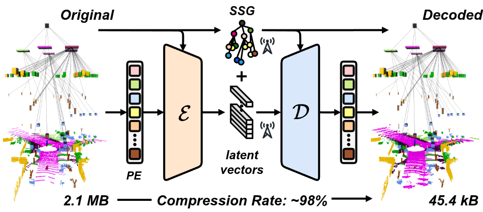

<div align="center">
  
# *Have We Scene It All?*
## Scene Graph-Aware Deep Point Cloud Compression

[](https://arxiv.org/abs/2510.08512)
[](https://doi.org/10.1109/LRA.2025.3623045)
  <a href="https://www.youtube.com/watch?v=MFKrhtmc3Tw"></a>
  
[](https://choosealicense.com/licenses/mit/) 

[**Nikolaos Stathoulopoulos**](https://github.com/nstathou) · [**Christoforos Kanellakis**](https://github.com/christoforoskanel) · [**George Nikolakopoulos**](https://github.com/geonikolak) 

</div>

<p align=center>  </p>

## 💡 Introduction

**Abstract:** Efficient transmission of 3D point cloud data is critical for advanced perception in centralized and decentralized multi-agent robotic systems, especially nowadays with the growing reliance on edge and cloud-based processing. However, the large and complex nature of point clouds creates challenges under bandwidth constraints and intermittent connectivity, often degrading system performance. We propose a deep compression framework based on semantic scene graphs. The method decomposes point clouds into semantically coherent patches and encodes them into compact latent representations with semantic-aware encoders conditioned by Feature-wise Linear Modulation (FiLM). A folding-based decoder, guided by latent features and graph node attributes, enables structurally accurate reconstruction. Experiments on the SemanticKITTI and nuScenes datasets show that the framework achieves state-of-the-art compression rates, reducing data size by up to 98% while preserving both structural and semantic fidelity. In addition, it supports downstream applications such as multi-robot pose graph optimization and map merging, achieving trajectory accuracy and map alignment comparable to those obtained with raw LiDAR scans. 

     

---

## 🚀 Setup

Tested with Python 3.8, should work with newer versions as long as you get the correct versions of PyTorch, torch-geometric, and Open3D.

### Prerequisites

- Python 3.8 or higher
- CUDA-compatible GPU (recommended for training)

### Installation

1. Clone the repository to your desired working directory:

```bash
git clone https://github.com/LTU-RAI/sga-dpcc.git
cd sga-dpcc
```


### Environment Setup

Using a virtual environment is strongly recommended. You can use any virtual environment manager you prefer.

#### Using Conda (Recommended)

```bash
conda create -n sga-dpcc python=3.8
conda activate sga-dpcc
pip install -r requirements.txt
```

#### Using pip with venv

```bash
python -m venv sga-dpcc-env
source sga-dpcc-env/bin/activate  
pip install -r requirements.txt
```


### Dataset Setup

1. Download the SemanticKITTI dataset from the [official website](https://semantic-kitti.org/dataset.html)
2. Extract the dataset to your desired directory
3. Ensure the dataset follows this directory structure:

```
path_to_dataset/
SemanticKitti/
├── semantic-kitti.yaml
├── calib.txt
└── sequences/
    ├── 00/
    │   ├── poses/          # 4x4 transformation matrix
    │   │   └── 00.txt
    │   ├── velodyne/       # Point cloud files
    │   │   ├── 000000.bin
    │   │   └── ...
    │   └── labels/         # Semantic labels
    │       ├── 000000.label
    │       └── ...
    ├── 01/
    │   └── ...
    └── ...
```

**Note:** Additional data structures (semantic scene graphs, etc.) will be generated in a later step during the training setup — see the **[Train](#train)** section below.


### Configuration

1. **Main Configuration**: Update `config/config-latest.yaml`
   - Modify all file paths to point to your corresponding directories
   - Set the correct path to your SemanticKITTI dataset
   - Adjust output directories as needed

2. **Autoencoder Configuration**: The `config/autoencoder.yaml` file controls:
   - Parameters for all compression layers
   - Training and testing hyperparameters
   - Model architecture settings

**Important Note**: In `config-latest.yaml`, the layer classes are defined based on SemanticKITTI label classes. Please note that layers 3 and 4 are reversed compared to the paper.

---

## 📦 Pre-trained Weights

1. Download the pre-trained weights from [Google Drive](https://drive.google.com/drive/folders/1uqyPaKKuTkqtskoj9h4XdJt-PfJAE5Mm?usp=drive_link)
2. Extract and place them in the `weights/checkpoints/` directory
3. Ensure the directory structure matches the existing checkpoint folders

---

## 🏋️‍♂️ Train

If you wish to just test with the pretrained weights just skip to **[Test](#test)** section. 

***to be updated***

...
---

## ⚙️ Test


<h2>📝 Citation</h2>

If you found this work useful, please cite the following publication:

```bibtex
@article{stathoulopoulos2025sgadpcc,
  author={Stathoulopoulos, Nikolaos and Kanellakis, Christoforos and Nikolakopoulos, George},
  journal={IEEE Robotics and Automation Letters}, 
  title={{Have We Scene It All? Scene Graph-Aware Deep Point Cloud Compression}}, 
  year={2025},
  volume={10},
  number={12},
  pages={12477-12484},
  doi={10.1109/LRA.2025.3623045}}
}

```
