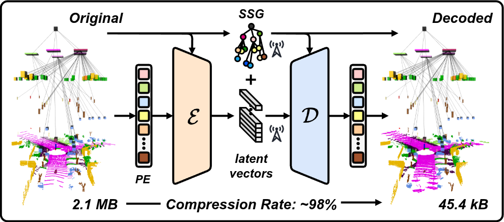

<div align="center">
  
<h1><em>Have We Scene It All?</em></h1>
<h2>Scene Graph-Aware Deep Point Cloud Compression</h2>

[](https://arxiv.org/abs/2510.08512)
[](https://doi.org/10.1109/LRA.2025.3623045)

[](https://choosealicense.com/licenses/mit/)

    
[**Nikolaos Stathoulopoulos**](https://github.com/nstathou) · [**Christoforos Kanellakis**](https://github.com/christoforoskanel) · [**George Nikolakopoulos**](https://github.com/geonikolak)

</div>

<p align=center>  </p>

<h2>💡 Introduction</h2>

**Abstract:** Efficient transmission of 3D point cloud data is critical for advanced perception in centralized and decentralized multi-agent robotic systems, especially nowadays with the growing reliance on edge and cloud-based processing. However, the large and complex nature of point clouds creates challenges under bandwidth constraints and intermittent connectivity, often degrading system performance. We propose a deep compression framework based on semantic scene graphs. The method decomposes point clouds into semantically coherent patches and encodes them into compact latent representations with semantic-aware encoders conditioned by Feature-wise Linear Modulation (FiLM). A folding-based decoder, guided by latent features and graph node attributes, enables structurally accurate reconstruction. Experiments on the SemanticKITTI and nuScenes datasets show that the framework achieves state-of-the-art compression rates, reducing data size by up to 98% while preserving both structural and semantic fidelity. In addition, it supports downstream applications such as multi-robot pose graph optimization and map merging, achieving trajectory accuracy and map alignment comparable to those obtained with raw LiDAR scans. 

 

***Code and pre-trained weights will be released before January 2026***

<h2>📝 Citation</h2>

If you found this work useful, please cite the following publication:

```bibtex
@article{stathoulopoulos2025sgadpcc,
  author={Stathoulopoulos, Nikolaos and Kanellakis, Christoforos and Nikolakopoulos, George},
  journal={IEEE Robotics and Automation Letters}, 
  title={{Have We Scene It All? Scene Graph-Aware Deep Point Cloud Compression}}, 
  year={2025},
  volume={10},
  number={12},
  pages={12477-12484},
  doi={10.1109/LRA.2025.3623045}}
}

```
